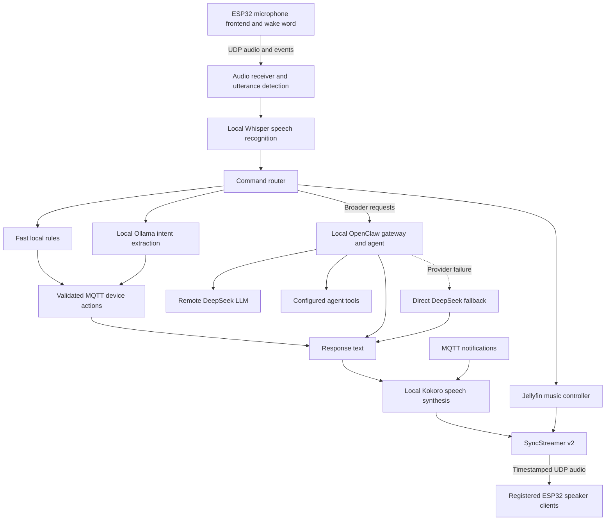

# Dobby Voice Assistant

Dobby is a home voice assistant that combines local speech processing and device control with a remote language model for broader requests. An ESP32 audio frontend listens for a wake word, a Linux host interprets the spoken request, and networked speakers play the reply. The system also controls MQTT devices, plays a Jellyfin music library, and speaks notifications from other home services.

The aim is to make everyday home interactions convenient and personal: common commands stay on the local network, more open-ended requests can use an agent with tools, and responses use a consistent Dobby-style voice and personality.

This is an evolving, installation-specific project. This README describes the source and configuration reviewed in September 2026; it is not yet a tested clean-install guide. Supporting services, model assets, and firmware live partly outside this folder. See [setup](docs/setup.md), [operations](docs/operations.md), and the [project review](docs/project-review.md).

## Capabilities

- Spoken device commands: on/off and supported level adjustments, defined by a device registry.
- Delayed device actions and one-shot actions triggered by registered MQTT sensors.
- Jellyfin artist, album, track, and playlist playback, with voice controls.
- Broader questions and requests through OpenClaw and its configured remote LLM and tools.
- Queued spoken MQTT notifications, with optional sound effects and voice selection.
- Web status, diagnostic recordings, and audio tests.

The current [device registry](device_registry.example.json) contains lights and thermostats. Actual capabilities depend on each device's configured actions; a device type alone does not imply support for every possible command.

## Architecture



[pipeline.py](pipeline.py) is the main Python process, coordinating receiver, transcription, routing, speech output, music, notifications, and the web interface. Several tasks run in background threads. Separate services include Whisper server, Ollama, an MQTT broker, OpenClaw, and Jellyfin where music is required.

### A spoken request, end to end

1. The frontend detects its wake word and sends `WAKE_DETECTED`. The frontend notes describe the wake phrase as “okay nabu”; this is separate from the Dobby response persona.
2. [receiver.py](receiver.py) collects UDP microphone audio, uses voice activity and control events to establish utterance boundaries, and queues the captured audio. The documented five-channel input carries four raw microphones and a frontend-processed channel.
3. The host selects or beamforms audio before transcription. MVDR is currently disabled and raw microphone channel index `1` is selected. The receiver uses the final incoming channel for VAD.
4. [stt.py](stt.py) calls the local persistent Whisper server, with a Whisper CLI fallback. [whisper_prompt.txt](whisper_prompt.txt) supplies vocabulary hints. The pipeline filters several forms of empty or likely spurious transcription.
5. [command_router.py](command_router.py) checks explicit cloud requests, music commands, and fast device-command rules. Other intent extraction uses Ollama. Results are checked against registered devices/actions, confidence, and action/timing/condition cues.
6. A local command produces a short templated response. Broader requests can go to OpenClaw with recent conversation context. Immediate device acknowledgment can precede or follow publication (`DEVICE_ACKNOWLEDGMENT_ORDER`). Publication failures produce a response; acknowledgment is not proof of physical device state.
7. Kokoro synthesizes the response locally and SyncStreamer sends it to registered speakers. The host restores listening with `READY` and releases audio suppression.

### Local LLM, remote LLM, and OpenClaw

| Component | Role in the reviewed installation |
| --- | --- |
| Rules and registry lookup | Handle common commands without a language-model call. |
| Ollama, `qwen2.5:1.5b` | Extract structured intent: device, action, value, delay, condition, confidence. The configured confidence threshold is `0.70`. |
| OpenClaw gateway | Accepts `/v1/chat/completions` requests and supplies the agent environment and configured tools. It is a separate local service, not the intent model. |
| DeepSeek through OpenClaw | The inspected gateway configuration selects `deepseek/deepseek-chat` as its primary model. This choice belongs to the external OpenClaw configuration. |
| Direct DeepSeek client | Uses `deepseek-chat` as the configured fallback when the OpenClaw provider fails. It generates text without OpenClaw's tool environment. |

The voice client sends OpenClaw a brief, speech-oriented persona prompt and up to 12 recent user/assistant messages. This conversation buffer is in memory and resets with the pipeline; OpenClaw has its own separate state.

For streamed cloud replies, the pipeline first speaks “Right away sir,” then attempts to speak completed sentences as they arrive. Tool execution can delay the substantive response. An explicit phrase such as “ask the cloud …” selects the cloud route, while short or ambiguous input is subject to filtering.

The remote LLM also refreshes response templates in the background approximately every 30–60 minutes. The interval is parameterized in `config.py`. Validated results are stored in `state/responses/current.json`, with only `previous.json` retained for diagnostics. [Seed templates](defaults/dobby_responses.json) support a fresh installation. Historical batches were consolidated after snapshots.

### Devices, sensors, music, and notifications

**Devices and sensors:** [device_registry.json](device_registry.example.json) defines invocation phrases and per-action MQTT topics, payloads, and optional value limits. [sensor_registry.json](sensor_registry.example.json) defines sensor topics or ChirpStack mappings and value extraction. Delayed actions and one-shot sensor conditions persist in SQLite, including level values. Conditions expire after the configured timeout (24 hours by default). Restart policy for overdue actions is configurable; uncertain interrupted publications are reported without automatic replay. See [durable automation](docs/operations.md#durable-automation).

**Music:** [jellyfin_music.py](jellyfin_music.py) searches the library, manages a queue, decodes audio, and sends it through SyncStreamer. [jellyfin_translations.txt](jellyfin_translations.txt) helps correct misheard artist names. Music audio is suppressed during microphone capture and TTS. Explicit interruption/resume is track-based; sample-accurate pause/resume is not promised.

The OpenClaw prompt and workspace advertise [jellyfin_cli.py](jellyfin_cli.py) as a music tool. The CLI now communicates with the pipeline's live player through a private Unix socket. The assistant and OpenClaw tool must run as the same Unix user. An unavailable service produces a clear CLI error.

**Notifications:** [mqtt_notifier.py](mqtt_notifier.py) subscribes to `assistant/notify/speak`. Producers send JSON such as:

```json
{"text": "The laundry is finished."}
```

Optional fields include `voice`, `speed`, `lang`, and `pitch_semitones`. Text can contain `{{sound:name}}` markers for effects from `sounds/`. Notifications use a background queue and can interrupt music.

**Weather:** `POST /weather/synthesise` accepts sensor/forecast data and calls [weatherdash.py](weatherdash.py), which uses DeepSeek directly. Separate weather scripts and notes exist in the OpenClaw workspace; their presence does not establish that a weather schedule is active.

## Audio and network interfaces

The current output path is **SyncStreamer v2**. Snapcast and UDP `SPK1` output modules remain in the folder but are not the output path selected by `pipeline.py`.

| Interface | Default port | Purpose |
| --- | --- | --- |
| Frontend → host, UDP | `4000` | Microphone audio, normally 16 kHz. |
| Host → frontend, UDP | `4001` | Listening/processing/TTS control. |
| Frontend → host, UDP | `4002` | Wake and utterance events. |
| Host → speakers, UDP | `5005` | SyncStreamer audio. |
| Host ↔ speakers, UDP | `5006` | Discovery and stream control. |
| Web interface, HTTP | `8080` | Status, diagnostics, integrations. |
| Whisper server, HTTP | `8081` | Local transcription. |
| Ollama, HTTP | `11434` | Local intent API. |
| OpenClaw, HTTP | `18789` | Configured agent endpoint. |
| MQTT broker, TCP | `1883` | Devices, sensors, notifications. |
| Jellyfin, HTTP | `8096` | Media API and audio. |

SyncStreamer sends 48 kHz stereo PCM in 256-frame packets at 187.5 packets/second. A packet has a 16-byte little-endian header and 1,024 bytes of PCM: 1,040 bytes total. Mono speech is duplicated into stereo. The sender marks TTS with the high bit of the sequence field. The default presentation lead is 400 ms.

Speakers announce themselves with `SYNC_HELLO`; registrations expire after 90 seconds without renewal. All registered clients receive output. Compatible speaker firmware is required and uses a different protocol from the microphone frontend.

See [SyncStreamer documentation](syncstreamer/README.md) for background and [protocol.py](syncstreamer/protocol.py), [source.py](syncstreamer/source.py), and [module.py](syncstreamer/module.py) for the implementation. The module documentation now describes the source, including its configuration boundaries and suppression behavior. SyncStreamer source was left unchanged.

## Project map

| Files or directory | Purpose |
| --- | --- |
| `pipeline.py`, `receiver.py`, `stt.py`, `beamformer.py` | Voice input and orchestration. |
| `command_router.py`, `automation.py`, device/sensor registries | Intent interpretation and MQTT actions. |
| `cloud_provider.py`, `cloud_llm.py`, `conversation.py` | OpenClaw, direct cloud fallback, short-term context. |
| `tts_dispatcher.py`, `tts_kokoro.py`, `models/kokoro/` | Active speech synthesis and assets. |
| `syncstreamer/` | Speaker discovery and audio transport. |
| `jellyfin_music.py`, `music_ipc.py`, `jellyfin_cli.py` | Integrated player and agent-facing IPC client. |
| `mqtt_notifier.py`, `sound_player.py`, `sounds/` | Notifications and effects. |
| `web_server.py`, `weatherdash.py` | Diagnostics and forecast synthesis. |
| `config.py`, `credentials.example.py` | Settings and starting point for credentials. |
| `response_cache.py`, `defaults/dobby_responses.json`, `whisper_prompt.txt`, `jellyfin_translations.txt` | Persona templates, vocabulary, name corrections. |
| `assistantctl.sh`, `start-whisper-server.sh` | Service helper and Whisper launch wrapper. |
| `testphrases.py`, `stt_regression_test.py`, `testwavs/` | Recognition diagnostics and recordings. |
| `whisper/` | Bundled Whisper source/build/model tree. |
| `tts_piper.py`, `snapcast_streamer.py`, `tts_udp_stream.py`, `barge_in.py` | Alternative or historical implementations. |

Associated installation folders outside the proposed project boundary include:

- `~/.openclaw/`: gateway configuration, agent workspace, tools, and runtime state. The workspace has Jellyfin tool and weather setup notes.
- `~/venvs/assistant/`: Python environment used by the installed service.
- `~/tts/`: Piper assets; the current dispatcher selects Kokoro instead.
- `~/llm_server/`: separate MQTT-to-Ollama bridge subscribing to `llm/request`. The current assistant calls Ollama over HTTP and does not import this bridge.
- `~/smart_home/templates/`, `~/smart_home_templates/`, and home-directory template JSON files: historical generated material, consolidated into the two-version cache after snapshots.
- `~/voice_data/`: wake-word sample recordings, not loaded by the main pipeline.

## Configuration and operation

See [setup](docs/setup.md) for pinned Python dependencies, model checksums, system unit
templates, and provisioning. See [operations](docs/operations.md) for all new settings.

- `WHISPER_MODEL` in `config.py` is the single model setting for server and fallback;
  it defaults to `small.en`, matching the reviewed running service.
- `RESPONSE_REFRESH_MIN_SECONDS` / `RESPONSE_REFRESH_MAX_SECONDS` control periodic cloud
  refresh (30–60 minutes by default); local replies use the two-version cache.
- `DEVICE_ACKNOWLEDGMENT_ORDER` selects speech `before` or `after` publication.
- `AUTOMATION_OVERDUE_POLICY` selects `skip` or `run` for timers overdue on restart.
- `credentials.example.py` now defines all credential fields, including Jellyfin.
  Private credentials and registries are excluded from tracking.

The supported layout uses system units `assistant.service` and `whisper-server.service`.
OpenClaw retains its user unit. The updated `assistantctl.sh` and diagnostic scripts
use that layout. Changing configuration requires a service restart.

```bash
./assistantctl.sh status
journalctl -u assistant.service -f
systemctl --user status openclaw-gateway.service
```

The web interface remains at `http://<assistant-host>:8080/`. Live diagnostics may
restart services, play audio, or send frontend controls. Offline unit tests use fake
services and temporary state. Multiple voice settings are intentional; see
[voices and output types](docs/operations.md#voices-and-output-types).

## Data flow and current limits

Speech recognition, intent extraction, and speech synthesis run locally. Broader requests send text and recent history to OpenClaw and its remote model. Background template refresh and weather synthesis also make cloud requests. The system is therefore not wholly offline, even when foreground device commands are handled locally.

Logs can contain transcripts, responses, and MQTT details; diagnostics save microphone recordings. The Flask interface binds to all interfaces and has no application authentication in its routes. It is an installation/LAN interface, not a public web service.

Current limits include in-memory conversation context, MQTT acknowledgment that cannot
prove physical device state, and hardware/model provisioning outside the source tree.
Streaming fallback speech is delivered without repeating completed sentences. Durable
jobs distinguish failed, skipped, expired, and interrupted/uncertain execution.

## Existing documentation and repository preparation

- [Frontend README](frontend_README.md): microphone hardware, wake word, and event protocol; `SPK1` speaker instructions describe an older path.
- [SyncStreamer README](syncstreamer/README.md): implemented v2 protocol, API, and configuration boundaries.
- [Server specification v2](server_specification_v2.txt): speaker design handoff; its implementation checklist is historical.
- [Older server specification](unused/server_specification_v1.txt): superseded v1 wire format.
- [Voice instructions](dobby_voice_instructions.txt): historical SoX proposal, not current settings or SciPy pitch processing.
- [Template notes](templates_notes.md): response categories and examples.
- [Project review](docs/project-review.md): evidence, integration gaps, and repository preparation.

This public repository was created from an audited source-only export with fresh Git
history. Credentials, local device/sensor registries, recordings, runtime state, and
model binaries are excluded. Private development snapshots remain outside this repository.
See [repository preparation](docs/repository-preparation.md) for the export process.
Dependency pins, model hashes, and sanitized examples are provided. A project license
and exact firmware revisions remain owner/release decisions.
